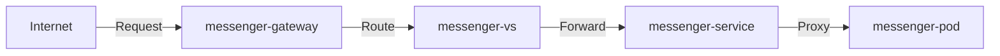

# Microservices

Для Canary deployment эти ресурсы используются так:
1) Pods: разные версии приложения
2) Services: доступ к разным версиям
3) Gateway: входная точка в кластер
4) VirtualService: правила распределения трафика между версиями

Rationale for gRPC:
1) Security-critical operations benefit from strict typing and schema validation
2) Binary protocol provides better performance
3) Built-in support for authentication tokens and metadata
4) Service-to-service communication efficiency
5) REST Gateway allows external clients to access via HTTP/JSON

Rationale for GraphQL:
1) Flexible data fetching for user profiles
2) Efficient retrieval of nested user data
3) Reduces over-fetching and under-fetching
4) Good for front-end clients that need different data shapes
5) Built-in documentation and introspection

Rationale for REST:
1) Simple CRUD operations
2) Well-understood by developers
3) Stateless nature fits friend relationships
4) Easy to cache and scale
5) Good tooling support

### Интеграция:

#### Service-to-Service (синхронная коммуникация):

* Прямые вызовы между сервисами через их API

* Используется когда нужен немедленный ответ

* Примеры: проверка авторизации, получение данных пользователя

#### Event-Driven / Kafka (асинхронная коммуникация):

* Публикация событий в очередь сообщений

* Сервисы подписываются на нужные им события

* Используется для:
1) Обновления данных между сервисами
2) Отправки уведомлений
3) Аналитики
4) Действий, не требующих немедленного ответа

#### Cross-Service Validation:

* Проверки между сервисами перед выполнением операций

* Обычно синхронные вызовы

* Пример: проверка наличия дружбы перед отправкой сообщения

* Все сервисы используют общий пакет для работы с Kafka

* Определены четкие события для асинхронной коммуникации

#### Реализованы три типа интеграций:
1) Синхронная (gRPC/REST/GraphQL) для прямых запросов
2) Асинхронная (Kafka) для событий и обновлений
3) WebSocket для real-time коммуникации

#### Pattern'ы интеграции:
1) Используем Event Sourcing для важных изменений состояния
2) CQRS для разделения операций чтения и записи
3) Saga для распределенных транзакций
4) Circuit Breaker для обработки ошибок между сервисами

#### Kafka используется для:
1) Обновления кэшей между сервисами
2) Рассылки уведомлений
3) Поддержания консистентности данных
4) Аналитики и аудита

### Мониторинг:
1) Prometheus для сбора метрик
2) Grafana для визуализации
3) AlertManager для оповещений
4) Node Exporter для системных метрик
5) Jaeger для трейсинга

#### Оповещения:
1) Service Down
2) High Error Rate
3) Slow Responses
4) High Memory Usage
5) Kafka Lag

#### Дашборды:
1) Service Health
2) Request Rate
3) Error Rate
4) Response Time
5) Kafka Message Rate
6) Memory Usage

#### Интеграции с внешними системами:
1) Slack для уведомлений
2) PagerDuty для критических алертов
