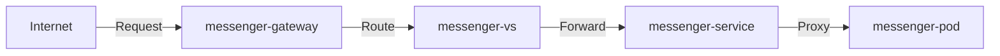

# Microservices

Для Canary deployment эти ресурсы используются так:
1) Pods: разные версии приложения
2) Services: доступ к разным версиям
3) Gateway: входная точка в кластер
4) VirtualService: правила распределения трафика между версиями

